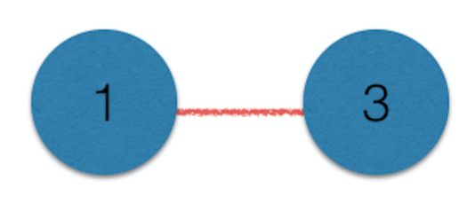
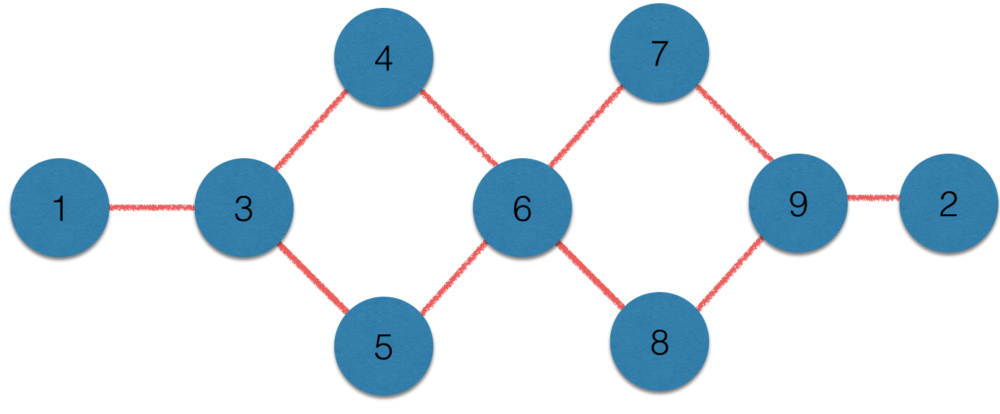

# Round 228 Division 2 問題Ｄ

## [題目](http://codeforces.com/contest/389/problem/D)

有一種題目，是給出一張圖，給出起始點與目標點，求出從起點到終點有幾條最短路徑，而這個問題剛好相反，是給出一個正整數 K，我們需要建出一張從起點到終點有**剛好** K 條最短路徑的圖(指定起點為1，終點為2)，有很多種可能的答案，輸出一個符合條件的即可。

## 題解

我們可以對題目要求的最短路徑總數做一下二進位表示法的分析，再加上乘法原理即可得到答案，即從左而右的去造出一張無相圖，來滿足題目的最短路徑總數。

舉例來說，如果我們要造出一張存在有9條最短路徑的圖，我們可以先求出9的二元表示法(9 = 8 + 1 => 1001)，然後依序造出

1. 包含 1 條最短路徑的圖。就直接造出一條兩點的連線即可。

2. 包含 2 條最短路徑的圖 (二進位表示法中的 10 為 2)。因為最後一位是0，所以只需要造出一個菱形即可。

3. 包含 4 條最短路徑的圖 (二進位表示法中的 100 為 4) 。因為最後一位是0，所以只需要造出一個菱形即可。

4. 包含 9 條最短路徑的圖 (二進位表示法中的 1001 為 9)。因為最後一位是1，所以需要造出一個菱形，加上一條從 1 到目前最遠的頂點的邊。

5. 最後記得補上連接到 2 的邊


### 示意圖

#### 4



input
```
4
```

output
```
9
NNYNNNNNN
NNNNNNNNY
YNNYYNNNN
NNYNNYNNN
NNYNNYNNN
NNNYYNYYN
NNNNNYNNY
NNNNNYNNY
NYNNNNYYN
```

#### 7

input
```
7
```

output
```
15
NNYNNNYNNNNYNNN
NNNNNNNNNNYNNNN
YNNYYNNNNNNNNNN
NNYNNYNNNNNNNNN
NNYNNYNNNNNNNNN
NNNYYNNYYYNNNNN
YNNNNNNYNNNNNNN
NNNNNYYNNNNNNNN
NNNNNYNNNNYNNNN
NNNNNYNNNNYNNNN
NYNNNNNNYYNNNNY
YNNNNNNNNNNNYNN
NNNNNNNNNNNYNYN
NNNNNNNNNNNNYNY
NNNNNNNNNNYNNYN
```


